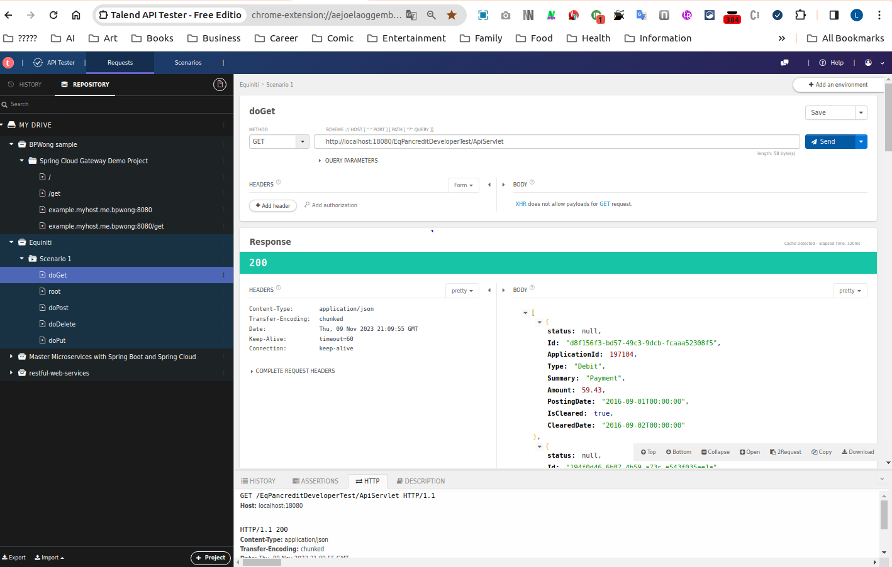

# Technical Test #

## Welcome to the Equiniti Credit Services Tech Test ##
This technical test is for candidates wishing to apply for Software Engineering roles with Equiniti Credit Services. It is designed as a starting point for conversation, we do not expect a full solution to be delivered at the end of it (45-75mins). What we do want is for you to have some fun showing us what you can do and how you do it and hopefully spark some conversation about why you made some of your decisions. If you feel there is insufficient time, please just tell us what you would do if you had more time.

While this is a test we would prefer you to think of it as a collaborative exercise / pair programming, with you as the driving force.

You may use internet searches during the test. We all do it.

Your solution can contain dependencies to publicly available packages. 

## What do we want you to do? ##
You will be provided with a skeleton Java Servlet solution (implementation class is ApiServlet) which you can extend as you wish.  You will be required to build (maven) and deploy (java web server) the code.  The landing page in a web browser is http(s)://server:port/EqPancreditDeveloperTest/ and to see the initial API GET result you can visit http(s)://server:port/EqPancreditDeveloperTest/ApiServlet.

We want you to create a REST API for a simple data set that we will provide (**resources/data.json**).

The REST API should allow for the following actions on the resource:
 
- create
- read
- update 
- delete 

We would like to see data access to the json file, no need for databases.

## Other Considerations ##

You should follow industry best practices and consider: 

- separation of concerns
- testability
- security (the API will be publicly accessible)
- scalability 
- performance

Ideally at the end of this process your solution will be structured, readable and maintainable. 

## Finally ##
Please ask for help if you get stuck.

Good luck and try to have fun.

## Lucas ##
I have updated the application to use Spring Boot, transforming it into a microservices application for several reasons:

- There is no need to set up an application server like Tomcat for this test.
- Spring Boot comes with an embedded Tomcat server, allowing the JAR to bind to a port and run as an API service directly. This approach is more flexible as it eliminates the need for deployment on an application server.
- It saves on the cost of application server licenses.
- The spring-boot-starter-tomcat library is included in the pom.xml. If there is ever a need to build a WAR file for deployment to an application server, simply changing <packaging>jar</packaging> to <packaging>war</packaging> in the pom.xml will suffice.

## How to play? ##
1. Copy the "data.json" file to the path you want, such as: /tmp/data.json
1.1 Configurable within the application.yml
1.2 Because we should use the data file out of the application package, so that the data.json file can be configurable without the need of rebuild the application.
2. Just run the jar then the microservices web application will be launched.
2.2. Example command: "java -jar EqPancreditDeveloperTest-3.jar"

## Simple APIs Testing ##

